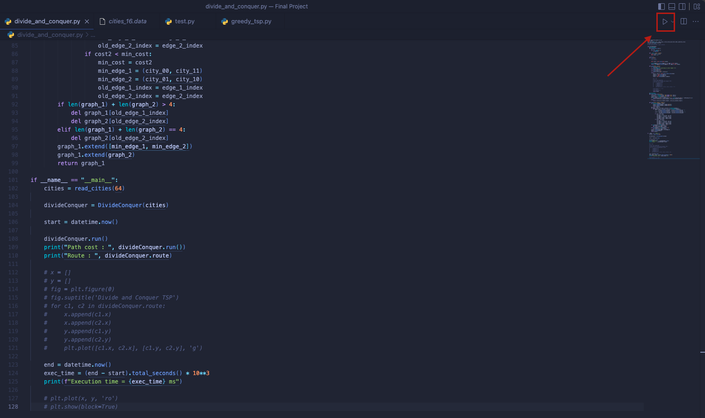

# Traveling Salesman Problem (TSP) Divide and Conquer vs  Greedy Algorithm
## Brigitte Sharon Alexander - 2602119190
## Evandra Harya Putra - 2602118433
## Jeff Matthew Hadisaputro - 2602118906
## Tirza Gabriella - 2602109870

# Running the Travelling Salesman Problem Using 2 algorithms (Greedy & Divide and Conquer)

## Step 1 : Pick 1 out of 2 algorithms you want to execute the Travelling salesman problem.

## Step 2 : We provided the user with the number of cities they want to solve during the traveling salesman problem. Therefore, they can run it using both algorithms. In addition, to insert the city data using the template (“coordinate (space) coordinate”). The user is required to enter the coordinates of both the arrival and departure cities in each data entry for the algorithm to run smoothly without any interference. 

## Step 3 : After picking one algorithm and how many cities the user want to solve, we can execute the algorithm

## Step 4: This window will pop off when the user executes the algorithm successfully. 

## In the terminal we also provide the user with the route and also the execution time to run the algorithm.

